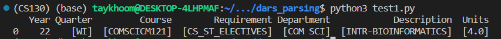
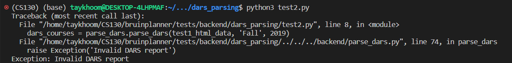
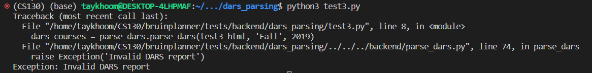

# DARS Parsing Unit Tests

    The following tests are dedicated to ensuring that the DARS parsing functionality is working as intended.

## Test 1: Positive Test

### Objective
    This test ensures that the DARS parsing functionality is working as intended when given a valid DARS file.

    The test is considered successful if the following conditions are met:

    1. The DARS file is parsed successfully without any exceptions.
    2. The parsed DARS file is identical to the expected DARS file.

### Input
    The input for this test is a minimal valid DARS file, attached in the test_data directory, as well as a starting year and quarter.
    For this test, our input is the following:

```python
dars_file = "test_data/test1.html"
start_year = 19
start_quarter = "FA"
```


    The relevant portion of the DARS file is shown below:

```HTML
<span class="subreqTitle srTitle_substatusNO">COM SCI SCI-TECH ELECTIVES</span>
<table class="completedCourses" summary="complete course table">
        <tr class="takenCourse ">
                <td class="term"	aria-label="term">WI22</td>
                <td class="course"	aria-label="course">COM SCI CM121</td>
                <td class="credit"	aria-label="credit"> 4.00 </td>
                <td class="grade"	aria-label="grade">G  </td>
            <td class="ccode" aria-label="condition code"></td>
            <td class="description" aria-label="description">
                <table>
                        <tr>
                            <td class="descLine">INTR-BIOINFORMATICS</td>
                        </tr>
                </table>
            </td>
        </tr>
</table> 
```

### Expected Output
```python
[('CS_ST_ELECTIVES', 'COMSCICM121', 'COM SCI', 'INTR-BIOINFORMATICS', 'WI', 22, 4.0)]
```
### Actual Output



## Test 2: Negative Test

### Objective 
    This test ensures that the DARS parsing function is able to handle invalid files (I.E. a random HTML file).
    Specifically, this test covers the case when the HTML file is not formatted as expected.

    The test is considered successful if the following condition is met:

    1. The DARS parsing code catches the exception and provides informative message output.

### Input
    The input for this test is an HTML file that is not in the correct DARS format, attached in the test_data directory as well as a starting year and quarter.

```python
dars_file = "test_data/test2.html"
start_year = 19
start_quarter = "FA"
```

```HTML
<!DOCTYPE html>
<html><body>
<h1>First Heading</h1>
<p>First paragraph.</p>
<h1>Second Heading</h1>
<p>Second paragraph.</p>
</body></html>
```
### Expected Output

    Here we expect an exception to be raised from the code at line 58 in the function parse_dars.py, printing that the passed file is an "Invalid DARS report"

### Actual Output

## Test 3: Empty DARS Test

### Objective
    This test ensures that the DARS parsing function is able to handle DARS files with no courses in the sections of interest.
    Specifically, this test covers the case when a new student attempts to upload their DARS whilst having no courses that satisfy any major requirements.

    The test is considered successful if the following condition is met:

    1. The DARS file is parsed successfully without any exceptions.
    2. The output is empty.

### Input
    The input for this test is a minimal valid DARS file (with no courses), attached in the test_data directory, as well as a starting year and quarter.
    For this test, our input is the following:

```python
dars_file = "test_data/test3.html"
start_year = 19
start_quarter = "FA"
```

    The relevant portion of the DARS file is shown below (note that the section underneath the electives tab is empty, and the html file
    ends here):

```HTML
<span class="subreqTitle srTitle_substatusNO">COM SCI SCI-TECH ELECTIVES</span>
	</body>
	</html>
```

### Expected Output
```python
[]
```

### Actual Output
