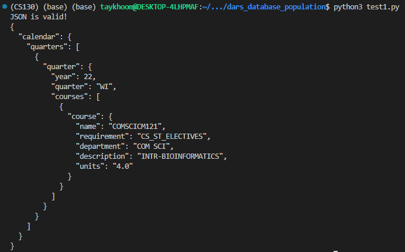
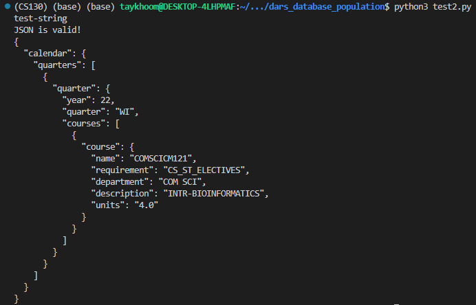
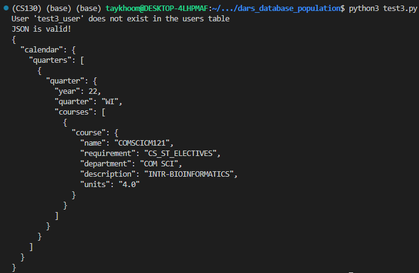

# DARS Database Population Unit Tests

The following tests are dedicated to ensuring that the parsed DARS is properly being converted to a JSON calendar and to ensure that the database is being populated correctly. In this case, since the parsed DARS is guaranteed to be correct, we only need to make sure that for a positive case the JSON is being generated correctly. For the database population, we need to check the case where the user is not in the database and the case where the user is in the database.

## Test 1: Positive Test for JSON Calendar

### Objective
This test ensures that the parsed DARS is properly being converted to a JSON calendar. The test will check that the JSON calendar is properly formatted and that the JSON calendar contains the correct information.

The test is considered successful if the following conditions are met:

1. The DARS file is converted to JSON Calendar object.
2. The output JSON object is identical to the expected JSON object.

### Input
The input for this test is a minimal valid DARS file, attached in the test_data directory, as well as a starting year and quarter.
For this test, our input is the following:

```python
dars_file = "test_data/test1.html"
start_year = 2019
start_quarter = "Fall"
```

The relevant portion of the DARS file is shown below:

```HTML
<span class="subreqTitle srTitle_substatusNO">COM SCI SCI-TECH ELECTIVES</span>
<table class="completedCourses" summary="complete course table">
        <tr class="takenCourse ">
                <td class="term"	aria-label="term">WI22</td>
                <td class="course"	aria-label="course">COM SCI CM121</td>
                <td class="credit"	aria-label="credit"> 4.00 </td>
                <td class="grade"	aria-label="grade">G  </td>
            <td class="ccode" aria-label="condition code"></td>
            <td class="description" aria-label="description">
                <table>
                        <tr>
                            <td class="descLine">INTR-BIOINFORMATICS</td>
                        </tr>
                </table>
            </td>
        </tr>
</table> 
```

### Expected Output
```python
JSON is valid!
{
  "calendar": {
    "quarters": [
      {
        "quarter": {
          "year": 22,
          "quarter": "WI",
          "courses": [
            {
              "course": {
                "name": "COMSCICM121",
                "requirement": "CS_ST_ELECTIVES",
                "department": "COM SCI",
                "description": "INTR-BIOINFORMATICS",
                "units": "4.0"
              }
            }
          ]
        }
      }
    ]
  }
}
```
### Actual Output


## Test 2: Positive Test for Database Population

### Objective 
This test ensures that the updateUserCalendar function is able to correctly update an existing users calendar in the database.

The test is considered successful if the following condition is met:

1. The calendar in the mysql database is correctly updated with the new calendar.

### Input
The input for this test is the minimal valid DARS file from the previous test, attached in the test_data directory, as well as a starting year and quarter. Furthermore we have an exising user ID.
For this test, our input is the following:

```python
dars_file = "test_data/test1.html"
start_year = 2019
start_quarter = "Fall"
id = "test2_user"
```

### Expected Output

Here we expect to see the original calendar in the database, which is just a string "test-string", the DARs file is uploaded and converted to a JSON calendar, and then the JSON calendar is converted to a string and stored in the database and printed out.

```python
test-string
JSON is valid!
{
  "calendar": {
    "quarters": [
      {
        "quarter": {
          "year": 22,
          "quarter": "WI",
          "courses": [
            {
              "course": {
                "name": "COMSCICM121",
                "requirement": "CS_ST_ELECTIVES",
                "department": "COM SCI",
                "description": "INTR-BIOINFORMATICS",
                "units": "4.0"
              }
            }
          ]
        }
      }
    ]
  }
}
```

### Actual Output


## Test 3: Neutral Test for Database Population

### Objective
This test ensures that the updateUserCalendar function is able to correctly add a new user and their calendar in the database.

The test is considered successful if the following condition is met:

1. The calendar in the mysql database is correctly updated with the user calendar.
2. The user is added to the database.

### Input
The input for this test is the minimal valid DARS file from the previous test, attached in the test_data directory, as well as a starting year and quarter. Furthermore we have a new user ID.
For this test, our input is the following:

```python
dars_file = "test_data/test1.html"
start_year = 2019
start_quarter = "Fall"
id = "test3_user"
```

### Expected Output
    
Here we expect to see the the user does not originally exist in the database, the DARs file is uploaded and converted to a JSON calendar, and then the JSON calendar is converted to a string and stored in the database and printed out.

```python
User 'test3_user' does not exist in the users table
JSON is valid!
{
  "calendar": {
    "quarters": [
      {
        "quarter": {
          "year": 22,
          "quarter": "WI",
          "courses": [
            {
              "course": {
                "name": "COMSCICM121",
                "requirement": "CS_ST_ELECTIVES",
                "department": "COM SCI",
                "description": "INTR-BIOINFORMATICS",
                "units": "4.0"
              }
            }
          ]
        }
      }
    ]
  }
}
```
### Actual Output
