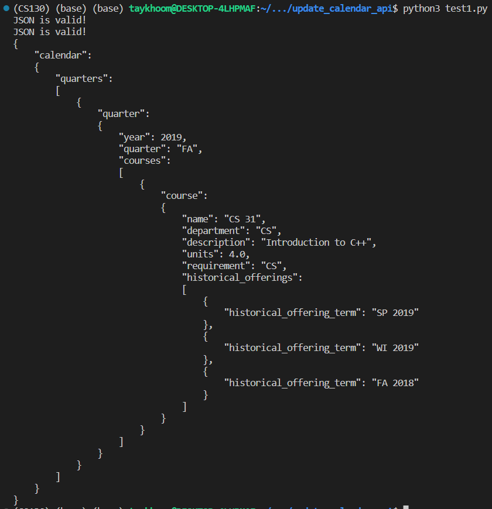
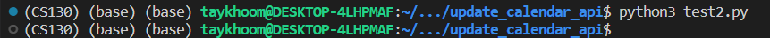
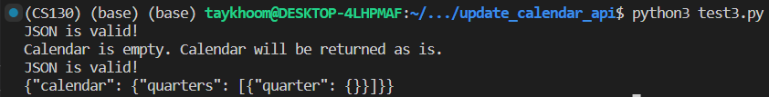
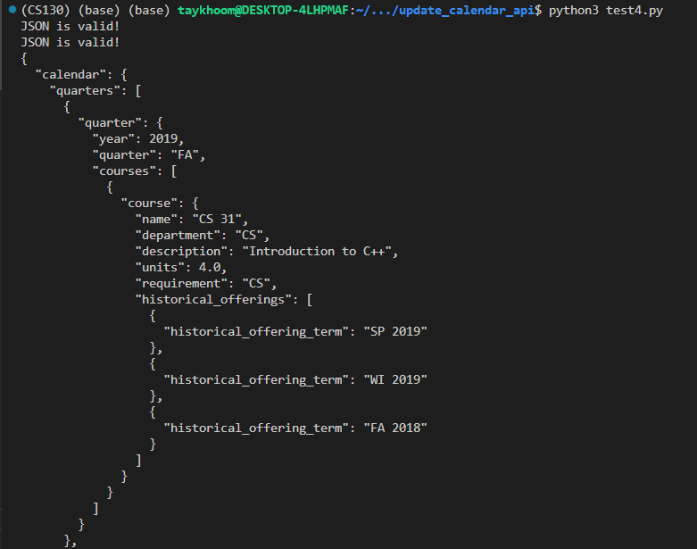
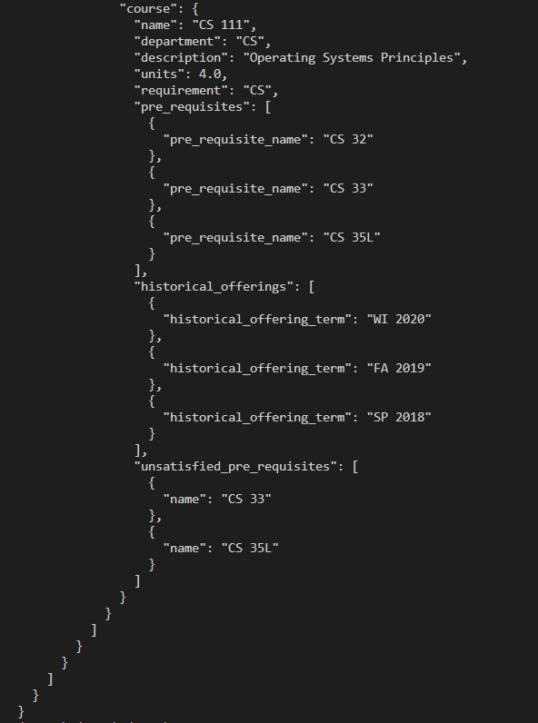

# updateCalendar API Tests

The following tests are dedicated to ensuring that the updateCalendar API is working as intended.

## Test 1: Positive Test

### Objective
This test ensures that the updateCalendar functionality is working as intended when given a valid calendar JSON with no prerequisite errors.

The test is considered successful if the following conditions are met:

1. The calendar JSON is successfully added to the database without any exceptions.
2. The returned JSON is identical to the original JSON.

### Input
The input for this test is a minimal valid calendar JSON, modified from the one found in the [json_format.py](../../../backend/json_format.py) file and a user ID
For this test, our input is the following:

```python
user_id = "test1_user"
test1_calendar = 
'''{
    "calendar": 
    {
        "quarters": 
        [
            {
                "quarter": 
                {
                    "year": 2019,
                    "name": "FA",
                    "courses": 
                    [
                        {
                            "course": 
                            {
                                "name": "CS 31",
                                "department": "CS",
                                "description": "Introduction to C++",
                                "units": 4.0,
                                "requirement": "CS",
                                "historical_offerings":
                                [
                                    {
                                        "historical_offering_term": "SP 2019"
                                    },
                                    {
                                        "historical_offering_term": "WI 2019"
                                    },
                                    {
                                        "historical_offering_term": "FA 2018"
                                    }
                                ]
                            }
                        }
                    ]
                }
            }
        ]
    }
}'''
```

### Expected Output

We expect the first JSON syntax check to pass, and the second JSON schema check to pass. We also expect the returned JSON to be identical to the original JSON.

```python
JSON is valid!
JSON is valid!
{
    "calendar": 
    {
        "quarters": 
        [
            {
                "quarter": 
                {
                    "year": 2019,
                    "quarter": "FA",
                    "courses": 
                    [
                        {
                            "course": 
                            {
                                "name": "CS 31",
                                "department": "CS",
                                "description": "Introduction to C++",
                                "units": 4.0,
                                "requirement": "CS",
                                "historical_offerings":
                                [
                                    {
                                        "historical_offering_term": "SP 2019"
                                    },
                                    {
                                        "historical_offering_term": "WI 2019"
                                    },
                                    {
                                        "historical_offering_term": "FA 2018"
                                    }
                                ]
                            }
                        }
                    ]
                }
            }
        ]
    }
}
```

### Actual Output


## Test 2: Negative Test (Syntax)

### Objective 
This test ensures that the updateCalendar functionality is working as intended when given a an invalid calendar JSON, in the case where there is a bug in the frontend code. Specifically, here we are testing for a syntax error in the JSON where each element in the quarter list should itself be a dictionary but instead is a list.

The test is considered successful if the following conditions are met:

1. The updateCalendar code catches the issue and lets the frontend know there was an issue by returning None.

### Input
The input for this test is a minimal invalid calendar JSON, modified from the one found in the [json_format.py](../../../backend/json_format.py) file and a user ID. Here we change the json format slightly as this is more likely of a bug than just sending a random JSON back.
For this test, our input is the following:

```python
user_id = "test2_user"
test2_calendar = '''{
    "calendar": 
    {
        "quarters": 
        [
            [
                "quarter": 
                {
                    "year": 2019,
                    "quarter": "FA",
                    "courses": 
                    [
                        {
                            "course": 
                            {
                                "name": "CS 31",
                                "department": "CS",
                                "description": "Introduction to C++",
                                "units": 4.0,
                                "requirement": "CS",
                                "historical_offerings":
                                [
                                    {
                                        "historical_offering_term": "SP 2019"
                                    },
                                    {
                                        "historical_offering_term": "WI 2019"
                                    },
                                    {
                                        "historical_offering_term": "FA 2018"
                                    }
                                ]
                            }
                        }
                    ]
                }
            ]
        ]
    }
}'''
```

### Expected Output

Here we expect None to be returned as the JSON is invalid. We assert that the JSON is invalid by checking that the returned JSON is None, so we do not expect any output.

### Actual Output


## Test 3: Empty Test

### Objective
This test ensures that the updateCalendar functionality is working as intended when given a an empty calendar JSON, in the case where the user has not added anything to their calendar and updateCalendar was called.

The test is considered successful if the following conditions are met:

1. The updateCalendar code does not error out.
2. The returned JSON is identical to the original JSON.

### Input
The input for this test is an empty calendar JSON (with no courses), and a user ID.
For this test, our input is the following:

```python
user_id = "\'test3_user\'"
test3_calendar
```

### Expected Output
    
Here we expect the JSON to be syntactically valid, but since its empty it cannot be checked for prerequisites. We expect the returned JSON to be identical to the original JSON.

```python
JSON is valid!
Calendar is empty. Calendar will be returned as is.
JSON is valid!
{"calendar": {"quarters": [{"quarter": {}}]}}
```

### Actual Output


## Test 4: Calendar with Prerequisite Errors

### Objective
This test ensures that the checkCalendar API correctly identifies prerequisite errors in the calendar JSON.

1. The returned JSON correctly identifies the courses that do not have pre-requisities identified.

### Input
The input for this test is a minimal valid DARS file (with no courses), attached in the test_data directory, as well as a starting year and quarter.
For this test, our input is the following:

```python
user_id = "\'test4_user\'"
test4_calendar = json_format.example
```

### Expected Output
    
Here we expect that the initial JSON and the JSON that was updated by the checkCalendar API are both syntactically valid. We expect the returned JSON to contain extra fields for each course that has unsatisfied prerequisites.

```python
JSON is valid!
JSON is valid!
{
  "calendar": {
    "quarters": [
      {
        "quarter": {
          "year": 2019,
          "quarter": "FA",
          "courses": [
            {
              "course": {
                "name": "CS 31",
                "department": "CS",
                "description": "Introduction to C++",
                "units": 4.0,
                "requirement": "CS",
                "historical_offerings": [
                  {
                    "historical_offering_term": "SP 2019"
                  },
                  {
                    "historical_offering_term": "WI 2019"
                  },
                  {
                    "historical_offering_term": "FA 2018"
                  }
                ]
              }
            }
          ]
        }
      },
      {
        "quarter": {
          "year": 2020,
          "quarter": "WI",
          "courses": [
            {
              "course": {
                "name": "CS 32",
                "department": "CS",
                "description": "Data Structures and Algorithms",
                "units": 4.0,
                "requirement": "CS",
                "pre_requisites": [
                  {
                    "pre_requisite_name": "CS 31"
                  }
                ],
                "historical_offerings": [
                  {
                    "historical_offering_term": "FA 2019"
                  },
                  {
                    "historical_offering_term": "SP 2019"
                  },
                  {
                    "historical_offering_term": "WI 2018"
                  }
                ]
              }
            }
          ]
        }
      },
      {
        "quarter": {
          "year": 2020,
          "quarter": "SP",
          "courses": [
            {
              "course": {
                "name": "CS 33",
                "department": "CS",
                "description": "Intro to Computer Architecture",
                "units": 4.0,
                "requirement": "CS",
                "pre_requisites": [
                  {
                    "pre_requisite_name": "CS 31"
                  }
                ],
                "historical_offerings": [
                  {
                    "historical_offering_term": "WI 2020"
                  },
                  {
                    "historical_offering_term": "FA 2019"
                  },
                  {
                    "historical_offering_term": "SP 2018"
                  }
                ]
              }
            },
            {
              "course": {
                "name": "CS 111",
                "department": "CS",
                "description": "Operating Systems Principles",
                "units": 4.0,
                "requirement": "CS",
                "pre_requisites": [
                  {
                    "pre_requisite_name": "CS 32"
                  },
                  {
                    "pre_requisite_name": "CS 33"
                  },
                  {
                    "pre_requisite_name": "CS 35L"
                  }
                ],
                "historical_offerings": [
                  {
                    "historical_offering_term": "WI 2020"
                  },
                  {
                    "historical_offering_term": "FA 2019"
                  },
                  {
                    "historical_offering_term": "SP 2018"
                  }
                ],
                "unsatisfied_pre_requisites": [
                  {
                    "name": "CS 33"
                  },
                  {
                    "name": "CS 35L"
                  }
                ]
              }
            }
          ]
        }
      }
    ]
  }
}
```

### Actual Output

*Note, the actual output is trimmed to only show the relevant parts (where the JSON is checked for syntactical validitiy and where the unsatisfied prerequisites are listed)



