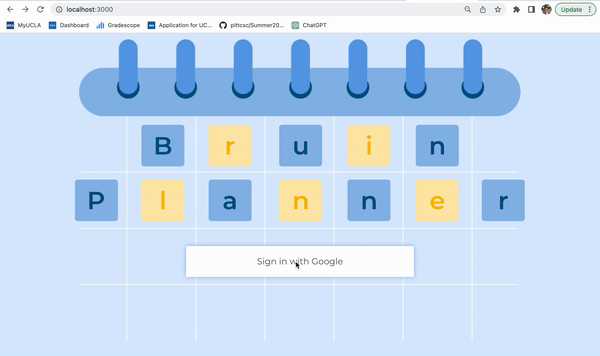

# Google Sign-in Tests
As this is a frontend UI test, there is no code to automate testing. The input is an interaction from a user, while the output is a visual element displayed on the screen.

## Test 1 (Positive): Successful login

### Objective

This test checks whether or not the user is taken to the DARs page upon a successful login from the landing page.

### Input

The user clicks the "Sign in with Google" button on the landing page, and successfuly logs in with their Google account.

### Expected Output

The user is redirected to the DARs page, which has a welcome message with their name: "Welcome, {name}!" 

### Actual Output

## Test 2 (Negative): Unsuccessful login

### Objective

This test checks whether or not the user is alerted of an unsuccessful login, and the user stays on the landing page.

### Input

The user clicks the "Sign in with Google" button on the landing page, but the login process is unsuccessful.

### Expected Output

The user is given an alert of the failure, and is *not* redirected to the DARs page.

### Actual Output

## Test 3 (Negative): Invalid access to page that requires logged-in user

### Objective

This test checks if the website is able to detect if a user is logged in or not, and change website behavior accordingly

### Input

The user is not signed-in, or signs-in unsuccessfuly. Then, they try to visit a page that requires a user to be signed-in.

### Expected Output

The user is asked to sign-in again.

### Actual Output

