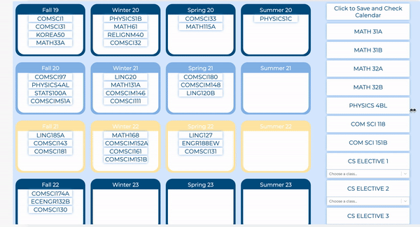
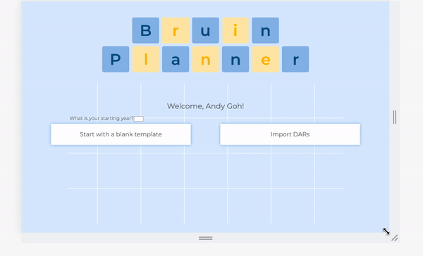

# Responsive Design Tests
As this is a frontend UI test, there is no code to automate testing. The input is an interaction from a user, while the output is a visual element displayed on the screen.

## Test 1

### Objective

This test checks whether or not the calendars resize dynamically dependong in the window size.

### Input

Resizing window

### Expected Output

Calendar blocks grow and shrink to fit the window size

### Actual Output

## Test 2

### Objective

This test checks whether or not the background image and buttons on the DARs page resize dynamically.

### Input

Resizing window

### Expected Output

Background image and buttons resize to fit the window size.

### Actual Output

