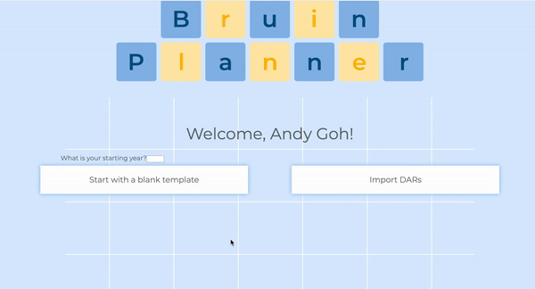
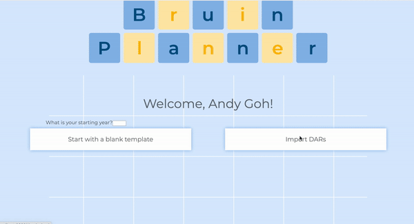

# Upload DARs Test
As this is a frontend UI test, there is no code to automate testing. The input is an interaction from a user, while the output is a visual element displayed on the screen.

## Test 1: Valid file, Successful Parsing

### Objective

This test checks whether or not the user is taken to a populated calendar page if they choose to upload a valid DARs.html, which is parsed correctly in the backend

### Input

The user clicks the "Upload DARs" button, uploads a valid DARs.html.

### Expected Output

The user is redirected to the calendar page, which is already populated with the user's previous courses.

### Actual Output

## Test 2: Invalid file or Unsuccessful Parsing

### Objective

This test checks whether or not the user is alerted if the backend parser raises an error.

### Input

The user either 1) clicks the "Upload DARs" button, uploads an valid DARs.html, but the backend parser runs into an error (e.g., connection error, edge-case, etc.), or 2) uploads an invalid dars file. They both produce the same result.

### Expected Output

The user is given an alert of the failure, and is suggested to populate the blank template themselves.

### Actual Output

